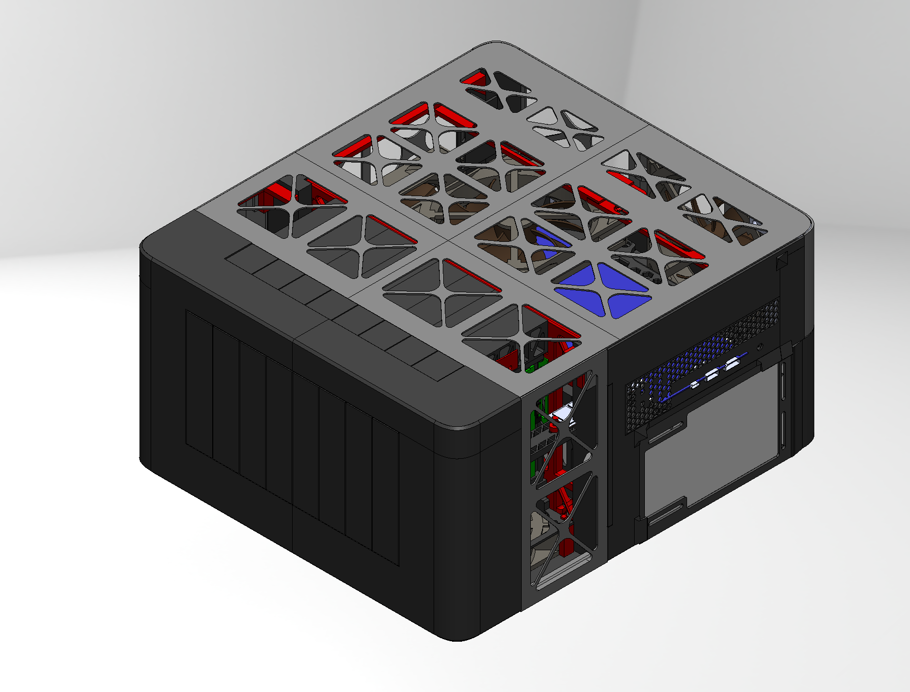

# matthews-macbook-air
these are the SOLIDWORKS files for the first revision of my home server case. though i never got around to fully 3d-printing this case, it should still be 3d-printable.

> For my second revision of this case (sheet metal, 2U rack mounted 12-bay HDD, with a custom backplane) visit this link:
> https://github.com/HynixCJR/serverv2_backplane

featuring:
- a motherboard and daughterboard that I extracted from an old [dell inspiron 5505](https://www.dell.com/support/manuals/en-ca/inspiron-15-5505-laptop/inspiron-15-5505-setup-and-specifications/processor?guid=guid-b426df85-6237-4365-b1fc-c3bb6e190257&lang=en-us)
- an asm1166 m.2 to sata adapter that i bought on taobao
- a sketchy 8-bay sata backplane i found on aliexpress

this is what the case looks like:

---

### what i'm currently running on my server
alas, printing takes a while, so i've already been using my server without fully printing the case. here's what i'm running on it:
- [proxmox ve 9.1](https://www.proxmox.com/en/products/proxmox-virtual-environment/overview) (i love you pve ❤️❤️❤️)
- [proxmox backup server](https://www.proxmox.com/en/products/proxmox-backup-server/overview)
- [immich](https://immich.app/) for all my photos
- [syncthing](https://syncthing.net/) for my obsidian.md vault
- [tailscale](https://tailscale.com/) for secure remote access
- [jellyfin](https://jellyfin.org/) so i can watch my own, legally obtained movies and tv shows
- arr* suite, iykyk
- standard smb share, for actual NAS purposes
- some projects that i'm working on (coming soon™)

---

i did not create the files for the [case fans](https://grabcad.com/library/case-fan-120mm-solidworks-1), [3.5" sata hdd](https://grabcad.com/library/3-5-sata-hdd-generic-model-1), [rpi cm5 io board](https://grabcad.com/library/raspberry-pi-cm5io-board-1), or [rpi cm4/cm5 antenna kit](https://grabcad.com/library/raspberry-pi-compute-module-4-antenna-1). these are not supposed to be printed because i have these parts already. also i don't think standard 3d printers can print semiconductors

there are also parts that are not meant to be printed, like the motherboard, rpi, daughterboard, fans, and hdds.
